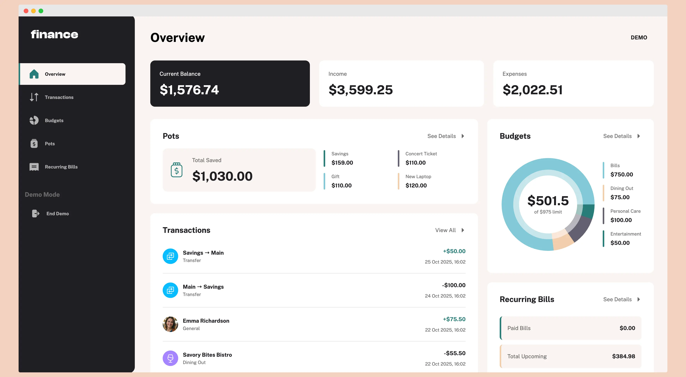
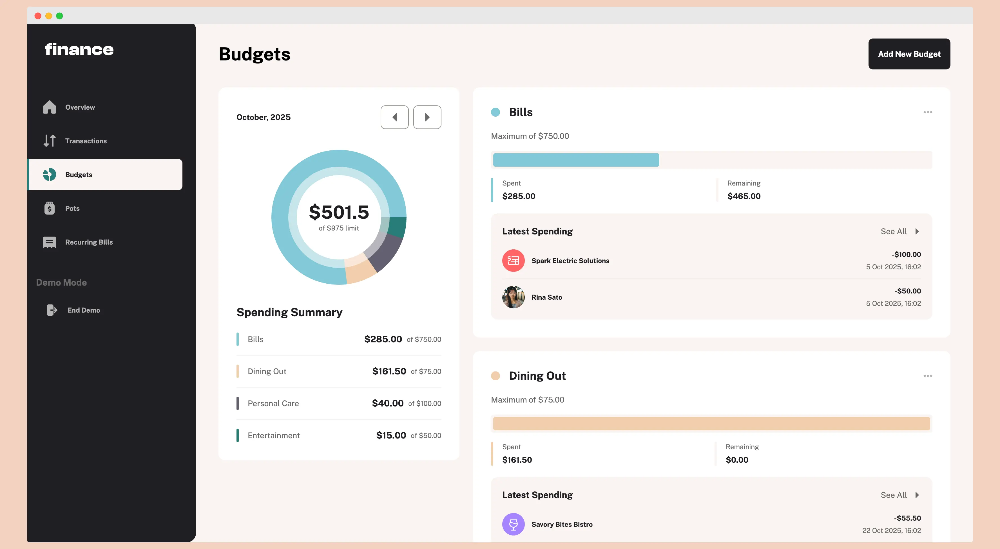
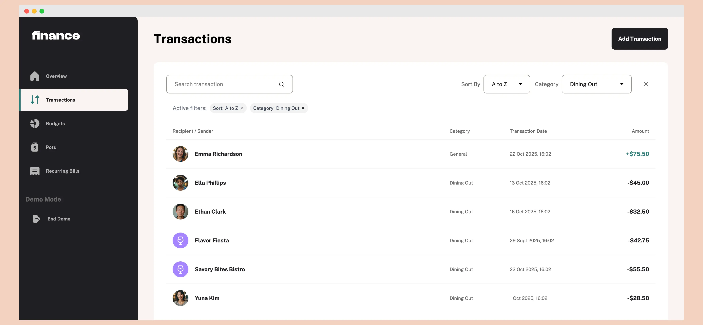
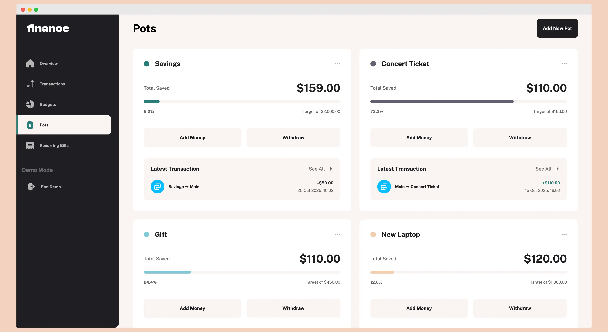
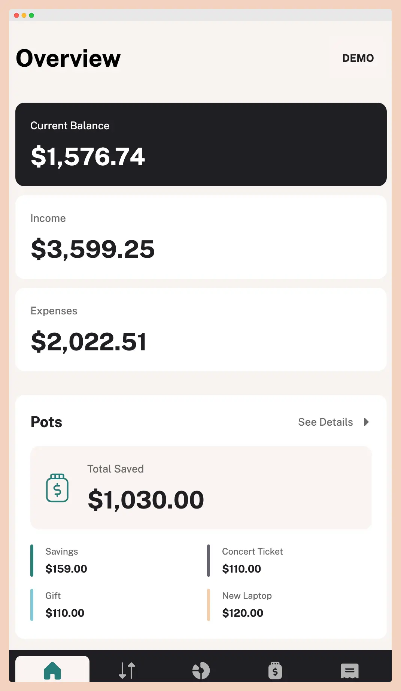

# Finance App

A full-stack personal finance tracking application built with React Router v7 and Supabase. Track income and expenses,
manage budgets, set savings goals, and visualize spending patterns.

[](https://reactrouter.com)

[](https://www.typescriptlang.org)

[](https://supabase.com)

[](https://tanstack.com/query)

**[Live Demo](https://mykhailonl.github.io/finance-app/)** • **[Features](#features)** • **[Tech Stack](#tech-stack)**

---

## Features

### Core Functionality

- **Transaction Management** - Track income, expenses, and transfers with detailed categorization
- **Budget Planning** - Set monthly budgets by category with visual spending analytics
- **Savings Goals (Pots)** - Create and track progress toward financial goals
- **Recurring Transactions** - Manage subscription-based and regular payments
- **Smart Filtering** - Filter transactions by category, type, and search query with sort options
- **Data Visualization** - Interactive charts and progress bars for spending insights

### Technical Features

- **Demo Mode** - Try the app instantly without registration, with localStorage persistence
- **Optimistic UI Updates** - Immediate feedback for all user actions
- **Undo Functionality** - Revert deletions within a time window via toast notifications (authenticated users only)
- **Real-time Sync** - Automatic data synchronization across sessions
- **Responsive Design** - Mobile-first approach with smooth animations
- **Type-safe Operations** - Full TypeScript coverage with generated database types
- **Row Level Security** - Database-level access control for multi-user safety

---

## Tech Stack

### Frontend

- **React 19** - Latest React with modern hooks and concurrent features
- **TypeScript** - Type safety throughout the application
- **React Router v7** - File-based routing with nested layouts
- **TanStack Query v5** - Data fetching, caching, and synchronization
- **Tailwind CSS** - Utility-first styling with custom design system
- **Motion** - Smooth animations and transitions
- **Recharts** - Data visualization and chart components

### Backend

- **Supabase** - PostgreSQL database with authentication, auto-generated REST API, and real-time subscriptions
- **Row Level Security** - Database-level authorization policies
- **Database Functions & Triggers** - Server-side business logic and automatic operations

### Tooling

- **Vite** - Fast build tool and dev server
- **ESLint + Prettier** - Code quality and formatting
- **TypeScript Strict Mode** - Maximum type safety

---

## Why This Stack?

**Supabase** provided a way to quickly set up a customizable backend without building a database layer from scratch. It
offers PostgreSQL with an auto-generated API while still allowing full control over schema and business logic through
triggers and functions.

**TypeScript** is standard for type safety in modern development.

**Tailwind CSS** kept development fast by avoiding separate CSS files for each component while maintaining consistency
through utility classes.

**TanStack Query** prevented redundant database requests through intelligent caching and handled automatic invalidation
when related data changed.

**React Router v7** was chosen to explore the file-based routing approach and understand how it simplifies application
structure.

---

## Architecture

The application follows a layered architecture with clear separation of concerns:

### 4-Layer Structure

**Layer 1: Database (Supabase)**

- PostgreSQL database with custom schema
- Row Level Security policies for data isolation
- Database triggers for automatic operations (user_id assignment, timestamp updates)
- Server-side functions for complex queries (balance calculations)

**Layer 2: Services**

- Type-safe API abstraction over Supabase client
- Centralized error handling
- Organized by domain (`budgetService`, `transactionService`, `potService`)
- Located in `app/services/`

**Layer 3: Data Hooks**

- React Query integration for data fetching and mutations
- Automatic cache invalidation on data changes
- Optimistic updates for instant UI feedback
- Separated into query hooks (`useBudgets`) and mutation hooks (`useBudgetMutations`)
- Located in `app/hooks/`

**Layer 4: UI Components**

- Presentational components with no direct API calls
- Consume data through custom hooks
- Organized by feature in `app/components/`
- Form logic isolated in `app/modals/`

### Key Architectural Decisions

**Demo Mode Architecture**

- Automatic activation for unauthenticated users
- localStorage as primary data source in demo mode
- Fallback chain: localStorage → Supabase → initial demo data
- All mutations work seamlessly with localStorage or database

**Authentication Flow**

- Centralized auth state in `AuthContext`
- Auth guard at application root prevents race conditions
- Row Level Security ensures users only access their own data
- Automatic user profile creation via database trigger
- Demo mode activates automatically for unauthenticated users

**Data Synchronization**

- TanStack Query manages cache lifecycle
- Mutations automatically invalidate related queries
- Optimistic updates for delete operations
- Background refetching keeps data fresh

---

## Development Highlights

### Demo Mode Implementation

Demo mode allows users to try the application without registration. When a user visits without authentication, demo mode
activates automatically.

**How it works:**

The app creates a mock user with a fixed `DEMO_USER_ID` and stores all data in browser localStorage using a
`demo_data_overrides` key. Each data hook checks the authentication state:

```typescript
if (isDemoMode) {
  // Check localStorage first
  if (demoOverrides.budgets) {
    budgets = demoOverrides.budgets
  } else {
    // Try reading from database (might have pre-seeded demo data)
    // Fall back to initial demo data if database is empty
  }
}
```

All CRUD operations in demo mode write to localStorage and update the React Query cache. This provides a realistic
experience while keeping data isolated to the browser.

**Data lifecycle:**

- First visit: App tries to load from database, falls back to predefined demo data
- User actions: All changes saved to localStorage
- Sign up/login: Demo data is cleared, user gets fresh authenticated session
- Sign out: Can optionally re-enter demo mode, starting fresh

Demo data does not transfer to a real account - it's purely for exploration.

### Undoable Deletions with Optimistic UI

Delete operations use optimistic updates to improve user experience (available for authenticated users only).

**How it works:**

When a user deletes an item, it immediately disappears from the UI. The actual database deletion is delayed while a
toast notification displays with an "Undo" option.

**Two outcomes:**

1. **No action**: After 5 seconds, the deletion executes on the database
2. **Undo clicked**: Item is restored from cache without any database operation

**Implementation:**

```typescript
// 1. Remove from UI immediately
queryClient.setQueryData(['budgets'], (old) =>
  old.filter(item => item.id !== deletedId)
)

// 2. Show toast with undo
toast.promise(deleteBudget(id), {
  action: {
    label: 'Undo',
    onClick: () => queryClient.invalidateQueries(['budgets'])
  }
})
```

This pattern required coordination between React Query's cache, the toast system, and the database layer. In demo mode,
this feature is disabled to avoid complexity with localStorage synchronization.

---

## Getting Started

### Try Online

Visit the live demo - no installation required!

**[Live Demo](https://mykhailonl.github.io/finance-app/)**

You can either:

1. **Try Demo Mode** - Explore all features without signing up (data saved in browser)
2. **Create Account** - Sign up to sync data across devices and sessions

---

## Project Structure

```
app/
├── routes/              # Page components (file-based routing)
├── components/          # Reusable UI components
├── modals/              # Form dialogs for CRUD operations
├── hooks/               # Custom React hooks for data management
├── services/            # API abstraction layer
├── context/             # React context providers (Auth, Modal, Screen)
├── validators/          # Form validation logic
├── utils/               # Helper functions
├── types/               # TypeScript type definitions
├── constants/           # App constants and demo data
└── assets/              # Static assets (fonts, images, icons)
```

---

## Screenshots

### Dashboard


*Main dashboard with balance summary and activity widgets*

### Budget Management


*Budget overview with spending charts and category breakdown*

### Transaction Filtering


*Advanced filtering with active filter tags*

### Savings Goals


*Individual pot with progress tracking and transaction history*

### Mobile Experience


*Responsive design optimized for mobile devices*

---

## License

MIT License - feel free to use this project for learning or as a portfolio piece.
